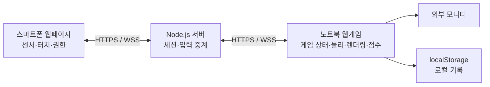
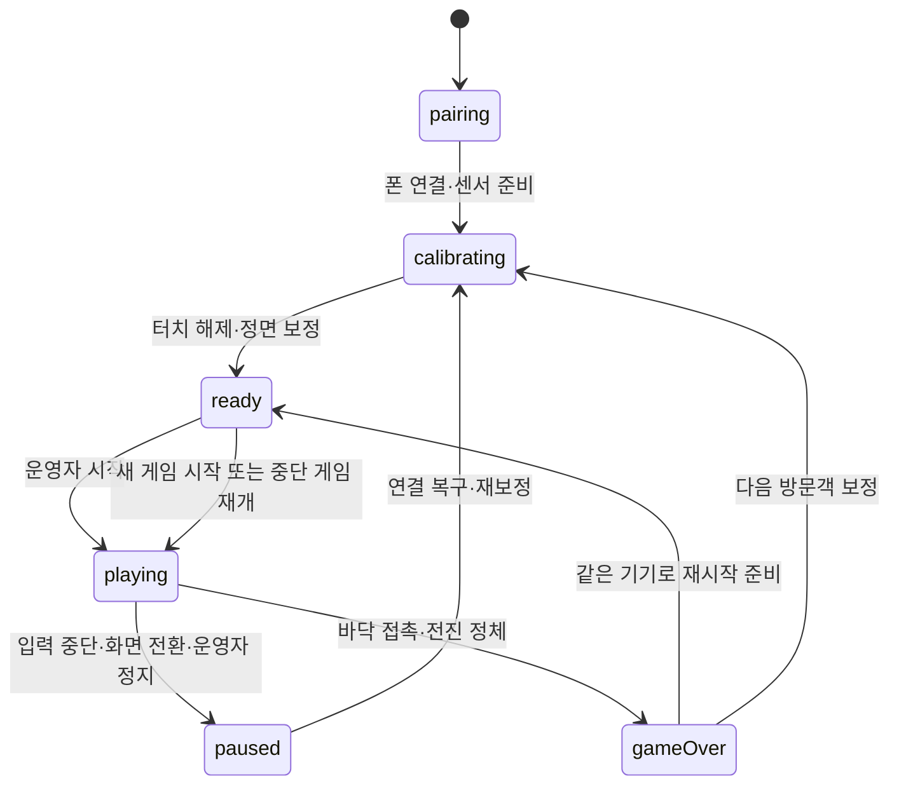

# 손목 웹슈터 웹스윙 게임 — Architecture

작성일: 2026-09-10 · 상태: 구현 전 설계 기준안

제품 요구사항: [PRD.md](./PRD.md)

## 1. 설계 범위와 기술 선택

단일 방문객의 스마트폰 입력을 노트북 게임에 전달하는 웹 애플리케이션이다. 서버는 연결과 입력 중계만 맡고, 게임 상태·물리·점수는 노트북이 결정한다. 현재 센서·터치·연결·정면 보정, 무한 도로의 스윙 물리, 점수·추락·정체 종료와 재시작이 구현되어 있다. 아래 구조 중 1,000m 좌표 재기준화, 한국풍 표현, 로컬 기록은 미구현이다. 성능과 실기기는 검증하지 않았다. [구현 현황](IMPLEMENTATION.md)을 참고한다.

| 영역 | 선택 | 근거와 부담 |
|---|---|---|
| 언어·빌드 | TypeScript + Vite | 클라이언트와 서버의 메시지 타입 공유, 단순한 웹 개발 구성 |
| 렌더링 | Three.js, WebGLRenderer | 1인칭 카메라와 단순 반복 건물에 필요한 기능을 직접 구성. 게임 루프·상태 관리는 별도 구현 |
| 물리 | `@dimforge/rapier3d-compat` | WASM 기반 3D 강체·충돌·형상 질의 사용. 줄 구속은 Rapier joint가 아니라 직접 구현한다. 비동기 초기화 완료 후 게임 준비 |
| UI | HTML/CSS | 단순한 HUD·메뉴·컨트롤러 화면. React와 React Three Fiber는 도입하지 않음 |
| 서버 | Node.js + Express + Socket.IO | 정적 빌드 제공, 세션 연결과 입력 중계. Socket.IO만으로 게임 상태 복구가 완성되지는 않음 |
| 저장 | 데스크톱 localStorage | 단일 부스의 로컬 상위 10개 기록. 서버 DB 없음 |
| 검증 | Vitest, Playwright, 실기기 체크 | 상태·물리 규칙, 브라우저 흐름, 센서·장착·지연을 나누어 검증 |

Three.js는 완성형 게임 엔진이 아닌 3D 라이브러리다. 본 프로젝트처럼 게임 규칙과 화면 범위가 작을 때 적합하지만 상태 관리 등을 직접 구현해야 한다. [공식 설명](https://threejs.org/manual/en/game.html)

Rapier는 물리와 형상 질의(raycast, shape cast)를 제공한다. 거미줄 렌더링, 표적 보정, 줄 구속, 부착 순간 추진력은 애플리케이션 책임이다.

Rapier의 rope joint는 쓰지 않는다. rope joint는 두 앵커 사이의 **최대** 거리만 제한하는데, 이 게임은 표적이 거의 항상 플레이어 앞쪽에 있고 플레이어가 그쪽으로 날아가므로 부착 직후 앵커까지 거리가 줄어들어 줄이 끝까지 느슨했다. 2026-09-14 헤드리스 측정에서 앵커가 20m 이상 앞이면 2초 내내 한 번도 팽팽해지지 않아, 부착하지 않은 것과 동일하게 1.92초에 추락했다. 대신 매 물리 step에서 줄 방향 속도를 직접 구속한다(5절). [Rapier 문서](https://rapier.rs/docs/)

대안 비교:

- **Babylon.js + Havok:** 통합된 3D·물리 접근도 가능하다. 이번에는 좁은 기능 범위에서 렌더링과 물리를 각각 직접 관리하는 구성을 선택했다. Babylon.js가 성능이나 개발 속도 면에서 열등하다는 판단은 아니다. [공식 물리 통합 자료](https://github.com/BabylonJS/Documentation/blob/master/content/features/featuresDeepDive/physics/v2/usingPhysicsEngine.md)
- **Phaser:** 2D 중심이므로 이번 3D 1인칭 요구와 맞지 않는다. [공식 설명](https://phaser.io/why-phaser)
- **WebRTC DataChannel:** 직접 입력 전송의 후보지만 초기 버전에서는 연결 수립·중계 환경을 추가하지 않고 Socket.IO로 시작한다. 실제 지연 목표를 충족하지 못할 때 재검토한다.

정확한 패키지 버전은 후속 구현 시 호환성을 확인한 뒤 lockfile로 고정한다. 현재 문서는 설치나 실행으로 검증한 버전을 주장하지 않는다.

## 2. 구성과 책임



- `/`: 노트북 게임, QR, 운영자 버튼, HUD, 결과 화면.
- `/controller`: 스마트폰 권한 안내, 큰 터치 영역, 연결 상태. QR의 세션 초대 정보로 연결한다.
- 서버: Vite 빌드 정적 파일과 Socket.IO를 같은 출처에서 제공한다. 실행 환경은 지속 프로세스와 WebSocket 업그레이드, HTTPS/WSS를 지원해야 한다. 호스팅 업체 선택과 실제 배포는 현재 범위 밖이다.
- 클라이언트 내부 책임은 입력 어댑터, 게임 상태, 스윙·물리, 월드 구간 관리, 렌더링·HUD로 나눈다. 거대한 범용 게임 프레임워크는 만들지 않는다.
- 마우스 입력도 같은 내부 `AimInput` 계약으로 변환한다. 폰이 없는 동안 게임 로직을 검증하는 개발용 대체 입력이다.

## 3. 연결과 메시지 계약

호스트가 세션을 생성하면 서버는 추측하기 어려운 세션 식별자, 초대 토큰, 호스트 복구 토큰을 발급한다. QR은 컨트롤러 URL과 초대 정보를 담는다. 컨트롤러 참여 후 별도 복구 토큰을 발급하고 활성 컨트롤러 하나만 허용한다. 추가 참여자는 사용 중 안내를 받으며 운영자가 기존 연결을 해제해야 교체할 수 있다.

서버의 메모리 Map에 세션을 보관한다. 빈 세션은 10분 후 제거한다. 서버 재시작으로 세션이 사라지면 새 QR로 연결하고 게임을 새로 시작한다. 현재 게임을 서버에 영구 저장하지 않는다.

최소 공유 타입의 기준안은 다음과 같다. 노트북은 wire 데이터의 타입·유한값·순번을 확인하고 방향 쿼터니언을 정규화한다. 서버는 소켓에 연결된 역할과 세션으로 라우팅하며 클라이언트가 지정한 임의 세션으로 중계하지 않는다.

```ts
type Quaternion = [number, number, number, number]; // x, y, z, w
type GamePhase = 'pairing' | 'calibrating' | 'ready' |
  'playing' | 'paused' | 'gameOver';

type InputFrame = {
  seq: number;
  orientation: Quaternion; // 화면 방향 보정 후 기기 자세, 정면 보정 전
  pressed: boolean;
};

type AimInput = {
  direction: [number, number, number]; // 게임 월드의 정규화 방향
  pressed: boolean;
};

type HostState = {
  phase: GamePhase;
  calibrated: boolean;
  reason?: 'inputLost' | 'hidden' | 'sensorUnavailable' |
    'fall' | 'stalled' | 'operator';
};
```

| 이벤트 | 방향 | 내용 |
|---|---|---|
| `session:create` | 호스트 → 서버, ACK | 새 세션·초대·복구 정보 |
| `session:join` | 폰 → 서버, ACK | 초대 정보 검증, 단일 컨트롤러 등록 |
| `session:resume` | 기기 → 서버, ACK | 역할별 복구 토큰으로 재연결 |
| `controller:input` | 폰 → 호스트 경유 서버 | `InputFrame` |
| `controller:status` | 폰 → 호스트 경유 서버 | 센서 사용 가능 여부, 페이지 활성 여부 |
| `host:state` | 호스트 → 폰 경유 서버 | `HostState` |
| `session:status` | 서버 → 양쪽 | 연결·이탈·교체 상태 |

입력은 최신 방향과 누름 상태를 최대 30Hz로 전송한다. 방향이 변하지 않아도 상태 프레임을 보내 입력 생존을 확인한다. 누름·해제 전환 시에는 기다리지 않고 즉시 같은 형식의 프레임을 보낸다.

연결되지 않았을 때 입력을 큐에 쌓지 않는다. 방향 프레임은 최신값만 중요하므로 volatile 전송을 사용하고, 터치 전환은 연결 중 일반 전송하되 재시도 큐를 만들지 않는다. 주기적인 전체 누름 상태가 누락된 전환을 보정한다. 노트북은 작은 순번의 프레임을 버린다. 재연결 시 입력 순번 기준과 터치 기준을 새로 설정한다.

기기간 시계 차이가 있으므로 폰 타임스탬프를 노트북 시계와 빼서 지연으로 취급하지 않는다. 입력 중단 판정은 노트북의 수신 시각으로 계산한다.

## 4. 모바일 입력과 상태 전이

### 센서와 터치

센서 페이지는 HTTPS로 제공하고, 필요한 환경에서는 사용자가 누른 시작 버튼 안에서 `DeviceOrientationEvent.requestPermission()`을 요청한다. API 존재 여부와 실제 센서 이벤트 수신을 각각 확인한다. 권한 거부나 센서 데이터 미수신은 안내 화면에 표시한다. [권한 문서](https://developer.mozilla.org/en-US/docs/Web/API/DeviceOrientationEvent/requestPermission_static)

`alpha/beta/gamma`를 회전 순서에 맞게 쿼터니언으로 변환하고 화면 회전을 반영한다. 이 값은 브라우저의 센서 기준 자세이며, 모든 폰에서 동일한 절대 북쪽 방향이라고 가정하지 않는다. [좌표계 문서](https://developer.mozilla.org/en-US/docs/Web/API/Device_orientation_events/Orientation_and_motion_data_explained)

운영자가 보정할 때 자세 `q0`를 저장한다. 폰의 상단 방향을 손가락 방향으로 보는 장착을 기준으로 하며, 기기 좌표의 `+Y`(폰 상단)를 조준축으로 쓴다(`client/host/aim.ts`의 `DEVICE_AIM_AXIS`. 상단이 팔꿈치를 향하게 장착하면 `[0, -1, 0]`으로 바꾼다).

조준각은 **지면 좌표계에서** 구한다. DeviceOrientation 쿼터니언은 기기 좌표를 지면 좌표(X 동, Y 북, Z 위)로 옮기므로, 조준축을 지면 좌표로 옮긴 뒤 `q0`의 조준축과 비교해 수평 방위 차를 좌우(yaw), 고도 차를 상하(pitch)로 쓴다. 게임 좌표계(Y 위, 전방 −Z)에서 상대 회전을 바로 적용하면 수직축이 달라 팔을 좌우로 돌려도 조준이 전혀 움직이지 않는다(2026-09-13 확인한 실제 버그). 이 방식에서는 조준축을 중심으로 손목을 비트는 회전(롤)이 조준을 바꾸지 않는다.

좌우·상하 부호는 손목 장착 자세를 시뮬레이션한 단위 테스트(`tests/unit/aim.test.ts`)로 확인했고, 실기기 장착 검증은 아직이다. 손 위치 이동은 추정하지 않는다. slerp 평활화는 아직 넣지 않았다. 화면 방향이 바뀌면 일시 정지 후 재보정한다.

터치 영역은 `touch-action: none`을 적용하고 Pointer Events의 pointerId 집합으로 관리한다. `pointerdown`에서 캡처하고 `pointerup`, `pointercancel`, 캡처 해제에서 제거한다. 집합이 비어야 해제다. 페이지가 숨겨지면 집합을 비우고 사용 불가 상태를 전송한다. 브라우저 시스템 제스처까지 모두 차단할 수 있다고 가정하지 않는다.

### 게임 상태



0.5초 동안 유효 입력이 없으면 즉시 물리·생존 시간·정체 타이머를 멈춘다. 명시적인 연결 해제나 페이지 숨김은 기다리지 않고 정지한다. 노트북 페이지가 숨겨진 경우에도 정지한다.

일시 정지에서 강체 상태와 부착 줄을 보존한다. 복구 시 손가락 해제를 확인하고 보정하며, 재개 직전 보존한 줄을 해제한다. 속도를 유지한 채 재개하므로 새로 누르기 전 자동 발사는 없다. 새 게임 시작과 중단 게임 재개는 별도 명령으로 구분해 재개 시 초기 추진력을 다시 주지 않는다.

### 거미줄 상태

`idle → firing → attached → idle`을 기본으로 한다. 최대 사거리까지 아무것도 걸지 못하면 `releasedRequired`로 이동해 다음 누름 전에 해제를 요구한다. `firing` 중 해제하면 이미 손을 뗀 상태이므로 즉시 `idle`로 돌아가 다음 누름을 받는다. 부착 후 해제는 즉시 앵커 구속을 제거한다.

표적은 발사 순간 확정하지 않는다. 누르는 동안 줄 끝이 발사 순간 고정한 출발점·방향에서 출발해 `web.travelSpeedMps`(120m/s)로 날아가며, 수직으로는 `web.travelGravity`(20m/s², 플레이어 중력과 별개)를 받아 완만한 포물선을 그린다. 매 물리 step마다 직전 줄 끝에서 현재 줄 끝까지의 구간만 검사해, 처음 걸리는 벽면에 부착한다(조준 보정 구체 스윕은 이 구간에도 그대로 적용한다). 발사 후 폰을 움직여도 줄의 경로는 바뀌지 않는다. 최대 사거리는 직선 거리가 아니라 날아간 경로 길이로 잰다. 부착하는 순간부터 물리 보조가 시작되므로, 먼 표적일수록 걸리는 데 더 걸린다(70m는 약 0.58초, 그동안 끝은 약 3.4m 처진다). 값은 모두 체감 검증 전 제안 초기값이다.

## 5. 물리, 조준, 월드

### 물리 업데이트

- 단위는 m·s, Y축 위쪽, 도로 전방은 -Z로 통일한다.
- Rapier 초기화 후 회전 고정 동적 구체 플레이어와 고정 건물 콜라이더를 생성한다. 빠른 충돌을 위해 플레이어 CCD를 활성화한다.
- 고정 1/60초 accumulator로 물리를 계산하고 렌더링은 직전·현재 상태를 보간한다. 한 렌더 프레임에서 최대 5회 step하고 남은 과다 누적 시간은 버린다. 생존·정체 시간은 실제 수행한 물리 step으로 증가한다.
- 바닥 접촉은 종료, 건물 접촉은 낮은 restitution으로 반사한다. 건물과 도로는 충돌 그룹으로 구분한다.
- 부착점을 좌표로만 기억하고 Rapier joint는 만들지 않는다. 줄 길이는 구속하지 않는다. 부착점은 실제로 맞은 지점 그대로 고정되고, 줄의 표시 길이는 플레이어가 움직이는 대로 변한다.
- 부착 중에는 매 step 적분 직전에 보조 속도를 더한다. 힘의 기준은 부착점이 아니라 도로 전방(-Z)이다.
  - 전방: 전진 속도가 `assistForwardTargetSpeed`보다 느릴 때만 `assistForwardAccel × dt`만큼, 목표를 넘지 않는 범위에서 채운다. 이미 빠르면 건드리지 않는다(감속시키지 않는다).
  - 좌우·상하: 플레이어에서 부착점으로 향하는 단위 벡터의 X·Y 성분에 각각 `assistLateralAccel`·`assistVerticalAccel`을 곱해 더한다. 거리로 세기를 바꾸지 않으므로 먼 표적이라고 더 세게 당겨지지 않는다. 낮은 곳에 걸면 아래로 당겨져 조준 높이의 의미가 남는다.
- 부착점까지 남은 전방 거리가 `assistFadeDistanceM` 이내면 모든 보조를 선형으로 줄인다. 부착점의 Z에 도달하거나 지나가면 그 부착의 보조는 끝나고, 뒤로 밀려도 다시 켜지지 않는다. 계속 나아가려면 앞쪽에 다시 쏴야 한다. 보조가 끝나도 줄은 손을 뗄 때까지 그대로 보이며 자동 해제·재발사는 없다.
- 속도만 더하므로 위치를 직접 옮기지 않는다. 중력과 Rapier 충돌 처리는 그대로 적용된다.
- 해제는 앵커 제거만 수행하며 속도를 다시 설정하지 않는다.

### 제안 물리·조준 초기값

다음 값은 실행 검증 전 시작점이다. 모두 하나의 게임 설정 모듈에 모으며 PRD에 있는 점수·정체·전송 주기 값도 같은 곳에서 관리한다.

| 항목 | 초기값 |
|---|---|
| 중력 / 플레이어 반지름 | 9.81m/s² / 0.4m |
| 시작 높이 / 전방 속도 | 18m / 14m/s |
| 전진 보조 목표 속도 / 가속도 | 30m/s / 24m/s² |
| 건물 restitution / friction | 0.2 / 0.1 |
| 발사 거리 | 3~70m |
| 조준 허용 각도 | 전방 기준 좌우 70°, 위 75°, 아래 35° |
| 조준 보정 반경 | 2.5m (고정 미터. 거리 비례 각도가 아니다) |
| 줄 길이 | 구속하지 않음 |
| 부착점 방향 당김 (좌우 / 상하) | 4m/s² / 48m/s² |
| 보조 감소 구간 | 부착점 앞 5m (부착점 통과 시 보조 종료) |
| 카메라 수직 FOV | 90° |

### 표적 선택과 카메라

카메라는 플레이어 위치를 따라가되 회전·롤을 강체에서 물려받지 않는다. 기본 시선은 항상 도로 전방이다. 첫 버전에는 강한 카메라 흔들림을 넣지 않는다.

조준 방향 ray가 사거리 내 건물에 맞으면 그 접촉점을 사용한다. 실패 시 같은 방향으로 보정 반경의 구체를 쓸어(shape cast) 첫 건물 접촉점을 찾는다. 미리 배치한 부착 후보점은 두지 않는다. 구체 중심의 이동 거리와 접촉점까지 거리는 다르므로, 스윕 접촉점의 실제 사거리와 직선 가시성을 검사한 뒤 미리보기·발사 표적으로 사용한다. 부착 직전에도 이동한 플레이어 위치에서 재검사한다.

앵커 높이는 제한하지 않는다. 조준한 벽면이 플레이어보다 낮아도 그 지점 그대로 부착하며, 더 높은 지점으로 자동으로 옮기지 않는다. **겨눈 곳에 걸린다**는 규칙을 유지하기 위해서다. 상향각 하한을 두면 조준 pitch가 곧 하한이 되어 아래쪽 조준 허용각(35°)이 통째로 쓰이지 않고, 낮은 벽면을 겨눴을 때 아무 반응이 없는 것처럼 보인다. 낮은 앵커에서는 진자가 추락을 막지 못할 수 있으며, 그 결과(충돌·추락)는 그대로 둔다. 사거리(3~70m)와 가림 판정은 유지한다.

표적 마커(발사 전 미리보기)와 실제 발사 판정은 같은 함수를 사용한다. 뻗어나간 줄이 최대 사거리까지 아무것도 걸지 못하면 발사를 끝내고, 걸리지 못한 줄이 같은 방향·같은 속도로 계속 날아가며 흐려지는 짧은 연출과 실패음을 낸다(눌렀는데 아무 반응이 없어 보이지 않게 한다).

거미줄은 선이 아니라 카메라를 향한 납작한 띠(`effects.strand`)로 그린다. 흰 심과 그보다 굵은 어두운 외곽선을 겹쳐 만화풍 윤곽을 만들고, 가닥을 따라 지그재그로 흔들며, 날아가는 동안에는 끝에 작은 뭉치를 붙인다. 날아가는 줄과 부착 줄이 같은 모양을 쓰고, 부착 줄은 가운데가 조금 늘어진다. 굵기·흔들림·샘플 간격은 모두 카메라까지의 거리(시선 각도)를 기준으로 정한다. 코앞의 줄이 화면을 덮거나 먼 줄이 사라지지 않게 하고, 줄이 카메라 위치에서 출발해 화면 한곳에 뭉치는 것을 막기 위해서다. 밝기를 깜빡이게 하지 않는다.

거미줄은 카메라 원점에서 시작하면 한 점으로 투영되므로, 발사·빗나감·부착 줄 모두 시작점만 카메라 오른쪽 아래로 옮긴다(`effects.beamOriginOffsetM`, 체감 검증 전 제안 초기값). 실제 조준 ray와 물리 앵커(끝점)는 이동시키지 않는다. 부착 줄은 부착 이후 해제까지 매 프레임 갱신하며 남는다. 빗나감 효과의 경과 시간은 렌더 프레임 시각을 기준으로 계산한다.

### 무한 도로와 기록

도로 폭 24m, 구간 길이 60m의 반복 구간으로 시작한다. 좌우 건물은 유리 오피스 3종의 모델 자원을 재사용하고 높이 45~70m, 전방 길이 18m, 간격 2~6m로 구성한다. 시작 높이(18m) 위에 걸 수 있는 벽면을 확보하려면 건물이 그보다 충분히 높아야 한다. 첫 구간을 위한 특례는 두지 않는다. 새 게임·재시작마다 새 seed를 만들고 구간 index와 조합해 높이·간격·모델 및 랜드마크 종류·좌우를 정한다. 같은 게임 안에서 구간 회수·재생성이나 일시정지·재개는 배치를 바꾸지 않는다. `buildChunk(index, seed)` 직접 호출은 재현 검증에 사용한다. 이동 장애물은 없다.

반복 건물 사이에 세종대 랜드마크(애지헌·대양AI센터)를 섞는다. `world.landmarkFirstChunk`(2)부터 `world.landmarkEveryChunks`(4) 간격으로 한 구간에 하나씩, 두 종류를 번갈아 놓고 한 쌍마다 좌우를 바꾼다. 정면은 항상 도로를 향하고 모델 바닥 경계로 같은 쪽 일반 건물을 비운다. 크기는 `world.landmarkScale`의 종류별 배율을 쓴다(애지헌 1.6, 대양AI센터 1.25). 배율 상한은 구간 길이 60m다. 모델 바닥 폭 × 배율이 60m를 넘으면 랜드마크가 이웃 구간까지 넘어가 회수 단위와 어긋난다. 대양AI센터(바닥 폭 48m)의 1.25가 그 상한이다.

현재 구간 앞 4개·뒤 2개를 유지하고, 부착 중인 앵커가 속한 구간은 회수하지 않는다. 멀어진 구간의 mesh·collider를 제거하며 공유 geometry·material은 구간마다 폐기하지 않는다. 생성·회수와 재시작 시 활성 객체 수를 확인한다.

로컬 전방 위치가 1,000m를 넘으면 플레이어·건물·앵커·카메라 보간 상태를 같은 양만큼 옮기고 누적 거리 offset에 반영한다는 설계였으나 **아직 구현하지 않았다.** 부착 중인 joint·앵커를 한 프레임에 함께 옮기는 위험에 비해 이 게임 길이에서 얻는 것이 적다고 보고 미뤘다([구현 현황](IMPLEMENTATION.md) 참고). 현재 정체 계산은 월드 좌표의 전방 최고 거리를 그대로 사용한다.

정체 기준점은 시작 위치다. 최고 전진 거리가 기준보다 5m 늘면 기준점을 현재 최고값으로 옮기고 타이머를 초기화한다. 5초 경고, 8초 종료다. 한 프레임 안에서 전진 갱신을 먼저 반영하고 종료를 판정한다. 점수는 `floor(activeSimulationSeconds * 10)`이다.

결과 저장은 버전이 붙은 localStorage 키에 닉네임·점수·기록 시각을 저장한다. 닉네임은 선택 입력, 최대 12자로 제한하고 비어 있으면 '익명'으로 표시한다. DOM에는 텍스트로 출력한다. 저장 불가 시 결과 화면은 유지하고 기록이 저장되지 않았음을 알린다. 브라우저 데이터 삭제 시 기록도 사라진다.

## 6. 검증과 운영 조건

### 자동 검증

- 입력 상태: 두 포인터 중 하나를 떼도 유지, 마지막 해제·취소 시 해제, 오래된 seq 무시, 재연결 직후 새 누름 요구.
- 거미줄: 단일 누름당 한 번 발사, 전진 보조가 목표 속도까지만 채우고 넘으면 가속하지 않는지, 좌우 당김이 부착점 방향으로 대칭인지, 부착점 높이에 따라 상하 당김 부호가 갈리는지, 부착점 앞 5m에서 보조가 선형으로 줄고 통과 후 다시 켜지지 않는지, 부착이 자유낙하 대비 궤적을 실제로 바꾸는지, 해제 전후 속도 보존을 검증.
- 점수·정체: 과거 최고점 이내 왕복은 초기화하지 않음, 임계값 경고·종료, 정지 중 시간 불변.
- 세션: 두 번째 컨트롤러 거절, 복구 토큰으로 재연결, 연결 중단 후 정지, 서버 세션 소실 안내.
- 브라우저 흐름: 모의 센서 입력으로 연결·시작·종료·재시작·복구를 확인. 모의 입력 통과를 실기기 호환성의 증거로 취급하지 않음.

### 실기기 검증

첫날 실제 iPhone Safari와 Android Chrome에서 손목 장착, 센서 권한, 2분 조준 유지·재보정, 중지·약지 터치 조합을 확인한다. 손목 동작과 화면 반응 방향이 일치해야 한다. 장착이 불가능하면 배경 제작을 진행하기 전에 입력 설계를 다시 협의한다.

핫스팟에 노트북을 연결하고 폰과 노트북이 모두 인터넷 서버에 접속하도록 한다. 같은 핫스팟이라고 직접 통신하거나 낮은 지연이 보장되는 것은 아니다. 센서에는 HTTPS가 필요하므로 인증되지 않은 단순 로컬 HTTP 접속을 운영 경로로 삼지 않는다.

입력 지연은 폰 터치 표시와 외부 모니터 반응을 함께 촬영해 추정하고 표본 수·중앙값·95백분위 값을 기록한다. 100ms 이내는 목표이며 아직 측정하지 않았다. 네트워크 RTT는 별도로 측정하고 센서·화면을 포함한 지연과 구분한다.

실제 노트북·외부 모니터에서 60fps를 목표로 한다. 30fps 미만이 지속되면 그림자 비활성화, 렌더 해상도 감소, 가시 구간 감소 순으로 운영자가 품질을 조절한다. 첫 구현은 실시간 그림자 없이 단순 조명과 재사용 건물 자원을 사용한다.

20분 연속 실행·10회 재시작·초보자 3명 체험으로 PRD의 수용 기준을 확인한다. 기록에는 기종·OS·브라우저·PC 사양·해상도·네트워크와 결과를 함께 남긴다.

## 7. 후속 구현 순서와 현재 한계

1. **1일차:** 모바일 센서·터치·중계·노트북 조준점. 실제 장착과 양쪽 OS 검증이 진행 조건.
2. **2~3일차:** 상자 건물에서 부착 보조·충돌·해제 구현, 물리 검증.
3. **4일차:** 반복 도로, 점수·정체·추락 종료, 재시작.
4. **5일차:** 한국풍 표현, HUD, 로컬 기록과 필요한 연출.
5. **6~7일차:** 연결 복구·성능 조정·실제 부스 장비 검증.

이 순서는 개발 인원·실제 투입 시간이 미정인 상태의 목표다. VR, 학교 상징 건물, 호스팅 업체 선정·계정 준비는 별도 후속 작업이다. 현재 문서만으로 장착 가능성, 물리 튜닝, 센서 안정성, 100ms 입력 지연, 60fps를 보장하지 않는다.
